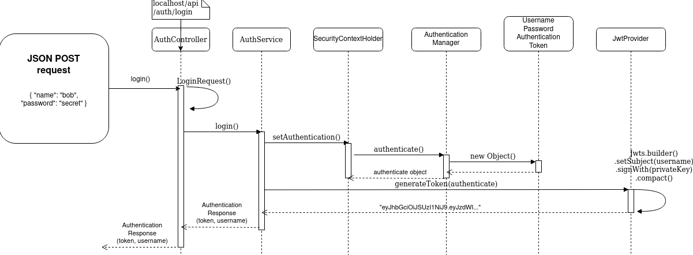

# Nightfly


To execute `application-local.properties` in IntelliJ
- `Run | Edit Configuration...`
- In  `Application` select the `Configuration` tab 
	- add `-Dspring.profiles.active=local` to `VM options`
- In  `JUnit` select the `Configuration` tab 
	- add `-Dspring.profiles.active=local` to `VM options`

Without these options the application will fail to load ApplicationContext and throw an `IllegalStateException`. 

#### Security
**Spring Security is a filter based framework. Either we are enabling existing filter and configuring it, or adding our custom filter.** `configure()` methods will be executed on *start up* to set up `HttpSecurity` or configure spring security filters. Requests has to pass through multiple filters to reach the API. 

Spring Security CSRF protection is *disabled* for now because this application currently only utilizes a REST api (stateless) and JWT instead of session cookies.

Passwords are hashed using [bcrypt](https://en.wikipedia.org/wiki/Bcrypt) and then stored in the database.

A `VerificationToken` is generated for each user. This is actually a `UUID`, a 128-bit number. The running application works with a 36 character long string representation of this `UUID`. However, this token is trimmed (`-` *characters removed*) and stored in binary form in the database. This conversion is performed by the `TokenConversion` class.

Also worth noting, MariaDB's `DATETIME` stores a date as a number down to microseconds. However, Java's `Instant` records a date down to nanoseconds precision. These extra nanoseconds will be truncated when inserted into the database. TODO: these should be truncated before adding to database to avoid mismatches.

#### Project Structure
- `config`: Complete security configuration for the whole application
- `controller`: Controller classes to handle requests from endpoints
- `dto`: Data transfer objects
- `service`: Main business logic
- `repository`: CRUD interfaces between domain classes and database entities
- `model`: Formal underlying data constructs. Each class has a matching entity in the database


### Diving into the code

#### Signup
- `AuthController` maps the JSON form data to a dto `RegisterRequest`
- `AuthService` uses the dto `RegisterRequest` to create a `User`
- `UserRepository` saves `User` to database
- `VerificationTokenRepository` saves a newly created token belonging to `User` (`VerificationToken`) to database
- `MailService` creates a `NotificationMail` which in turn utilizes `MailContentBuilder`, and send it as an account verification email to the user 


The `RegisterRequest` class must match the JSON attributes coming in from the request after a signup (`{ "email": "bob@somedomain.no", "username": "bob", "password": "secret" }`) 


#### Login
- `AuthController` maps the JSON form data to a dto `LoginRequest`
- `AuthService` uses the dto `LoginRequest` to create a `UsernamePasswordAuthenticationToken` which is passed to `Authentication` to create an instance
- `Authentication` object is passed to `SecurityContextHolder`
- `JwtProvider` generate a JWT token from the `Authentication` object
- JWT is wrapped in `AuthenticationResponse` and returned


The `LoginRequest` class must match the JSON attributes coming in from the request after a signup (`{ "username": "bob", "password": "secret" }`) 



---

##### Dependencies
- `mariadb-java-client`: Connector to a mariadb database
- `spring-boot-starter-validation`: `@NotNull`, `@NotBlank`, `@Valid` annotations for validating email addresses and other input
- `spring-boot-starter-mail`: To send verification email upon user registration
- `spring-boot-starter-thymeleaf`: To send html emails for verifying created users


## SQL
User 
```
CREATE TABLE IF NOT EXISTS user (    
        user_id INT NOT NULL AUTO_INCREMENT PRIMARY KEY,    
        email VARCHAR(255) NOT NULL,    
        username VARCHAR(255) NOT NULL,    
        password VARCHAR(255) NOT NULL,    
        created DATETIME NOT NULL,    
        enabled BOOLEAN NOT NULL    
        );  
```


VerificationToken
```
CREATE TABLE IF NOT EXISTS verification_token(    
        id INT NOT NULL AUTO_INCREMENT PRIMARY KEY,    
        token BINARY(16) NOT NULL,    
        user INT NOT NULL,    
        expiry_date DATETIME NOT NULL,    
        FOREIGN KEY (user) REFERENCES user(user_id) ON DELETE CASCADE    
        );   
```

## Benchmarks

##### User registration
* Without `@Async`
	* **2000 ms**
* `@Async` 
	* **500 ms**
* Scaling
	* Message Queues

## Tests (TBA)

* Create user
* Activate user account
* Access control of user with/without privileges
* Notification mail
* Login user
* jwt parse
